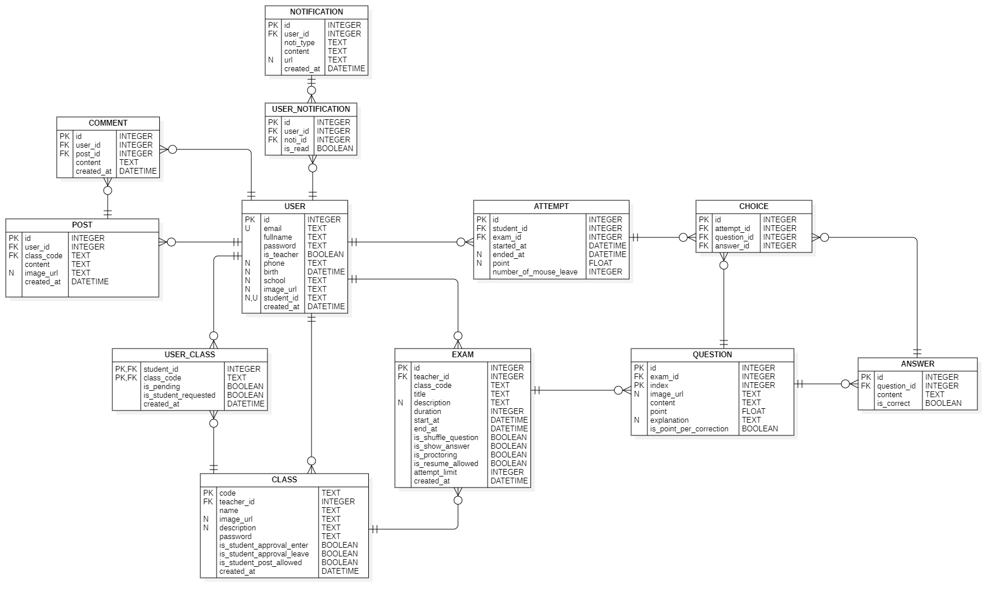

# Class Management & Examination

## BRD
- Exam module
  - CRUD exam
  - import questions/answers from Excel
  - export exam to Excel
  - copy exam
  - take exam
  - proctoring exam (force fullscreen, leave screen counter, ...)
  - shuffle questions

- Class module
  - CRUD class
  - invite student to class (bulk from Excel file)
  - remove student from class
  - leave class
  - config password for class

- Post module
  - CRUD post
  - comment to a post

- Common module
  - search
  - filter
  - login/registration (support UTC account!)
  - update user profile
  - approve/reject request to join class
  - statistics:
      - late submit
      - attempt number
      - score
      - history
      - ...
  - view exam schedule

- Improvements
  - support smart editor when creating exam
  - forgot password
  - questions suggestion when creating exam
  - socket for real-time notification
  - export to docx format
  - cancel class-joining request

## DB design

## Tech stack
- FE: React + Vite + Antd + Zustand (not really :D)
- BE: Express + Socket
- DB: MySQL + Prisma