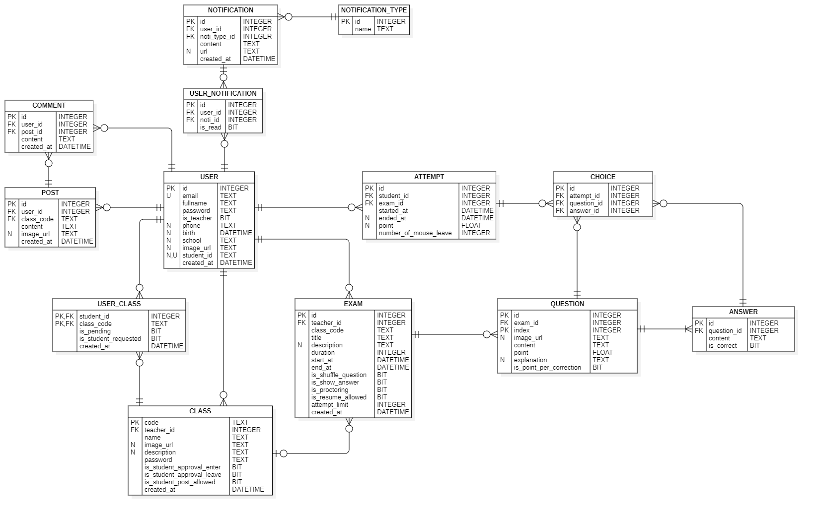

# Class Management & Examination

## BRD (by roles)
- Teacher
  - manage classroom:
    - create a class
    - add/remove student in class
    - update class metadata
    - share a class via link or QR code
    - deactive a class
    - delete a class

  - manage exam:
    - create an exam (including many exam codes)
      - 3 ways:
        - mannually by hand
        - by smart editor
        - by word/excel/pdf file
      - questions suggestion
    - assign an exam to a class
      - can assign multiple class at once
    - duplicate an exam
    - import/export an exam
  - mark exam (can be manually or automatically)
  - upload a post to timeline
  - upload file in class

- Student
  - join/leave a class
  - take exam

- Common
    - login/sign up (supports login via UTC account!)
    - forgot password (❌)
    - 
    - update/view profile
    - statistics:
      - late submit
      - attempt number
      - score
      - history
      - ...
    - check exam schedule
    - searching:
      - user
      - exam
      - class
    - notify (via email & app)
    - accept/decline request (cancel request after send)
    - comment in a post

- Examination proctoring
    - Always fullscreen
    - Detect when click/tab out

## DB design

## Tech stack
- FE: React + Vite + Antd + Zustand (not really :D)
- BE: Express + Socket (not enough time...)
- DB: MySQL + Prisma